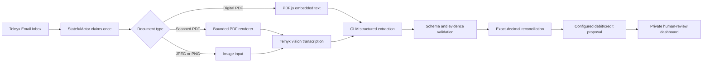

# Invoice-to-Ledger AI Agent

An email-native invoice review workflow built on Telnyx Edge Compute, StatefulActor and
Telnyx Inference. It receives invoice attachments, checks intake completeness, extracts
structured invoice data with provenance, proposes balanced debit/credit entries and
independently recalculates the invoice before presenting it for human review.

The agent deliberately stops before posting, payment, tax filing or financial reporting.

## Why this project is different

- **Evidence-first extraction:** every extracted value carries a page number and source quote.
- **Two document routes:** PDF.js handles embedded text; scanned PDFs and images use a bounded
  visual path through Telnyx Inference.
- **Independent arithmetic:** exact-decimal TypeScript recomputes line extensions, subtotal,
  tax and total instead of asking the model to verify itself.
- **Durable orchestration:** a StatefulActor owns polling, atomic claims, deduplication,
  schedules and job state.
- **Human-controlled accounting:** suggested entries come from trusted configuration and are
  always labelled for review. The model cannot choose account IDs or post entries.
- **Inspectable delivery:** the private dashboard exposes completeness, extraction,
  suggestions, reconciliation and the original document side by side.

## Processing flow



The configured extraction model is `zai-org/GLM-5.3-Flash`. Digital PDFs require one model
call for structured extraction. Scanned PDFs and direct images first use the same
vision-capable model to transcribe visible page content, then use the strict extraction pass.

## Core controls

| Control | Implementation |
|---|---|
| Duplicate prevention | Atomic source-key uniqueness and durable claims |
| Completeness | Expected count with optional supplier/invoice manifest |
| Money | Canonical decimal strings; no floating-point authority |
| Provenance | Page-and-quote evidence for every non-empty value |
| Attachment safety | MIME/signature checks, bounded size/pages and hostname allowlist |
| Model boundary | Strict schema, fixed model configuration and no account-ID control |
| Posting | Disabled; output is a review proposal only |
| Privacy | Authenticated dashboard, no-store responses and private local artifacts |

## Local verification

Requirements: Node.js 22 or 24. Scanned-PDF processing locally also needs Poppler's
`pdftoppm`; the separate hosted renderer uses PDFium.

```bash
npm ci
npm run doctor
npm test
npm run typecheck
npm run demo
npm run slice:local
```

The offline suite uses synthetic fixtures and fake transports. It does not require credentials
or make Telnyx requests.

## Local agent

Copy `.env.example` to `.env` and configure a dedicated Telnyx test inbox. Never commit that
file or use real invoices without an approved data-handling policy.

```bash
cp .env.example .env
npm run agent:preview
npm run agent:local
```

Open `http://127.0.0.1:3000`. The generated local review password is stored with restricted
permissions under `.private/`.

## Telnyx deployment

`telnyx.toml` declares the Edge function, Telnyx API binding, StatefulActor and named secret
bindings. Account-specific function IDs are intentionally excluded from this repository.
Configure encrypted secrets through the Telnyx Edge CLI, deploy the PDF renderer, then ship
the main function. Live acceptance commands are guarded and do not run from CI.

The main hosted components are:

1. **Edge function** — serves authenticated HTTP routes and the review dashboard.
2. **Bookkeeping StatefulActor** — polls, claims, calls inference, validates, reconciles and
   stores durable state.
3. **PDF renderer function** — converts bounded scanned-PDF pages to JPEG for vision input.

## Project structure

- `src/` — extraction, evidence, reconciliation, accounting and runtime code
- `src/edge/` — StatefulActor, Edge routes, dashboard and direct Telnyx transports
- `edge-pdf-renderer/` — bounded PDFium renderer
- `tests/` — unit, contract, security and durable-workflow tests
- `fixtures/` — synthetic invoice answer key and arithmetic oracle
- `scripts/` — offline checks plus guarded local/live operators
- `docs/` — architecture references and processing visualization

## Scope and limitations

This repository supports simple normalized net invoices. Credit notes, tax-inclusive prices,
discounts, complex tax treatments, unsupported precision and missing material values are routed
to review. Arithmetic agreement proves only internal numerical consistency—it does not prove
extraction accuracy, tax correctness or accounting approval.

The included accounting mapping is intentionally demonstrative. Production use requires a
customer-approved chart of accounts, currency policy, tax policy, permissions and retention
controls.
